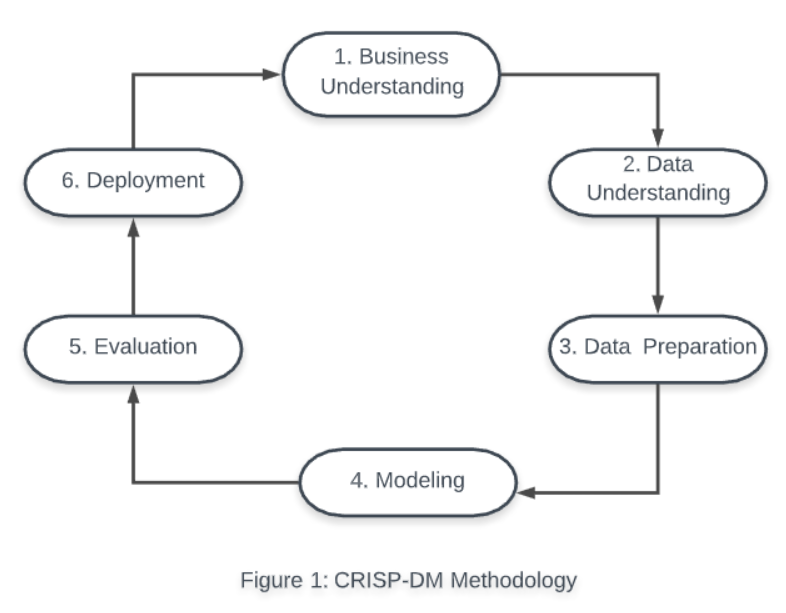

## Welcome to Data Analysis using CRISP-DM
In this project we will analyse the Goodreads-books dataset from the Kaggle website. 

### Table of Contents

1. [Installation](#installation)
2. [Motivation](#motivation)
3. [What is CRISP-DM?](#CRISP-DM)
4. [Queries](#Queries)
4. [Jupyter Notebook File Descriptions](#files)
4. [Summary Results](#summaryresults)
5. [Licensing, Authors, and Acknowledgements](#licensing)

## Installation 

The available python notebook files should run with Anaconda distribution of Python versions 3.*.

The dataset is available here books.csv must be downloaded to the current working directory of your Python installation.

To check for the current working directory in the notebooks just type os.getcwd(). To change the current working directory, you can use the os.chdir function in the notebooks, e.g. if your current working path is c:\projects, the statement you would want to execute is os.chdir("c:\\projects").

## Motivation

As a software developer I always wanted to develop a second hobby i.e. to read non-technical and interesting books or stories. Recently I found myself reading reviews about non-technical books on websites like Amazon and even looking for good books for my kids. During such occasion I stumbled upon https://www.goodreads.com.com and noticed that the site provides not only a good list of books to read but also questions on books to test your knowledge. When I saw the Goodreads-books dataset in Kaggle, I was immediately interested to explore it. But how do I use the CRISP-DM data mining methodology on this dataset and explore it? I wanted to spend time to do an Exploratory Data Analysis (EDA) on this dataset and at the same time also understand the CRISP-DM methodology. So, here we are with this Good-reads repo.

## What is CRISP-DM?

CRISP-DM stands for Cross Industry Standard Process for Data Mining. It provides a structured approach to planning a data mining project.
The process involves six main steps for data mining.

Our main aim with this repo is to provide a practical understanding of this methodology and not rewrite the documentation about each steps since these are available online. For a more detailed information about each steps in this methodology please read https://www.datasciencecentral.com/profiles/blogs/crisp-dm-a-standard-methodology-to-ensure-a-good-outcome.

## Queries :thinking: 

To get more insights about the Goodreads-books dataset, I wanted to find answers for the following questions: 

1. Which authors wrote the most books (peek into the top 10)?

2. Who are the top 10 highly rated and the bottom 5 poorly rated authors?

3. Did the books with more text reviews receive higher ratings?

4. Did the ratings for Harry Potter series follow a trend?

5. How books distributed across languages?
			   
## Jupyter Notebook File Descriptions 

There are three python notebooks attached to this repo. Each of these notebooks explore separate steps of the CRISP-DM methodology inorder to understand the dataset and infer useful insights from it.

1. **DataExploration.ipynb**
     - This notebook explores the data to understand each features available in it. We perform univariate descriptive analysis on each feature to understand the data better. We also creae plots like Histograms and Box-plots for the quantitative variables. For qualitative variables we look at the breakdown of unique values.
				
2. **DataAnalysis.ipynb**
     - This notebook looks at each features and performs dataminig analysis on the selected input variables (X's) in-order to predict the average rating (Y). We split the data into two sub-samples based on high and low user ratings for books. We then train and test two models to predict average ratings on these two subset data. Finally, we understood the model quality based on the average prediction errors by looking at Mean Absolute Error (MAE), Mean Squared Error (MSE) and Root Mean Squared Error (RMSE).

3. **Queries.ipynb**
     - This notebook looks at the business related queries we wanted to ponder by using break-down statistics and data mining techniques.
			   
## Summary Results

The results are well summarized in each of the Python notebooks. Also, to provide a general understanding of the overall analysis we performed in this project please check out the blog post here.

## Licensing, Authors, Acknowledgements

You can find the Licensing for the data and other descriptive information at the Kaggle link available [here](https://www.kaggle.com/jealousleopard/goodreadsbooks). Also I should mention that the article link explaining the CRISP-DM methodology was shared from [here](https://www.datasciencecentral.com/page/search?q=CRISP+DM).

